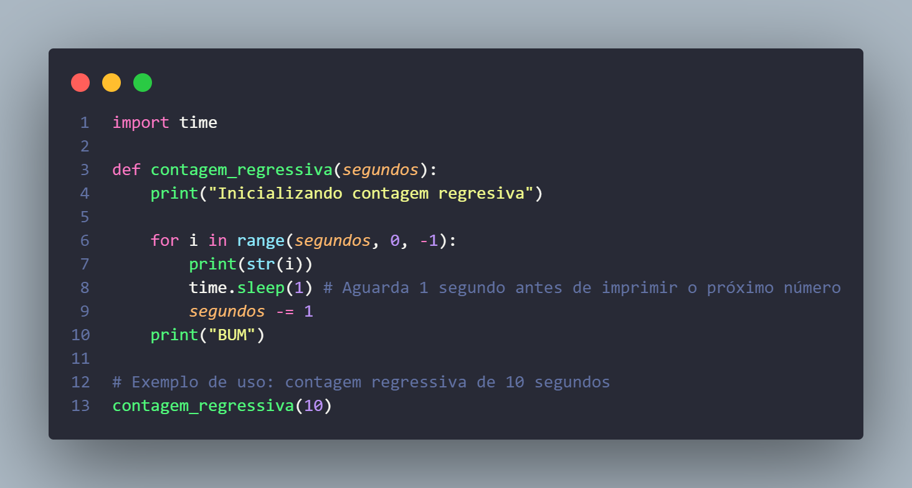
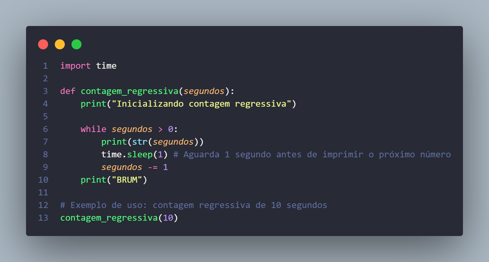

# Exercício da Proz em python

## Projeto Contagem Regressiva da Bomba em Python

##### QUESTÃO:

- Faça um código que execute a contagem regressiva de uma bomba,
informando o número de segundos para explodir. Ele deverá mostrar a
mensagem "iniciando contagem regressiva", os segundos passados e, no final,
a mensagem "BUM!".

##### EXTRA:

- Não é necessário, mas, caso deseje tornar o sistema mais realista para que o
tempo realmente passe em segundos, você pode usar a função time.sleep()
que existe na Python (acesse o link na próxima página). No entanto, é preciso
adicionar uma biblioteca antes de executá-la.

##### DESCRIÇÃO:

Este repositório contém um programa em Python que realiza uma contagem regressiva de uma bomba, informando o número de segundos para explodir. O programa exibe a mensagem "Iniciando contagem regressiva", os segundos restantes e, no final, a mensagem "BUM!".

##### RECURSOS:
- Utiliza a função time.sleep() da biblioteca time para aguardar 1 segundo entre cada contagem.
- Permite ao usuário digitar o número de segundos para a contagem regressiva.
- Cria uma experiência realista ao simular o tempo passando em segundos.

##### INSTRUÇÕES DE USO:

(1) -`Execute o programa em um ambiente Python.`

(2) -`Digite o número de segundos para a contagem regressiva.`

(3) -`Observe a contagem regressiva em andamento, com uma pausa de 1 segundo entre cada número.`

(4) -`Ao final da contagem, a mensagem "BUM!" será exibida.`

Sinta-se à vontade para utilizar este código como referência ou adaptá-lo para suas próprias necessidades. Divirta-se!

<table>
  <tr>
    <th>

    

##### SCREENSHOT RESPOSTA COM FOR:

    </th>
  </tr>
  <tr>
    <td>
    

##### SCREENSHOT RESPOSTA COM WHILE:

    </td>
  </tr>

Clique em 👉 [Google Colabory](https://colab.research.google.com/drive/1_p_-ZLx77LXEkmqX-9l1GzYtUOdXwFRI?usp=sharing) 👈 para acessar o exercutavel online.